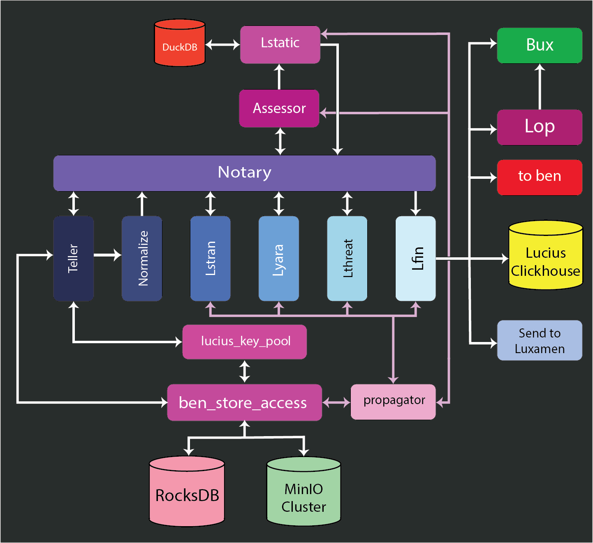

# Lucius at a glance

Lucius is the *light scrub* sanitizer in the Ben ecosystem.

Where Ben focuses on intent enforcement and policy orchestration, Lucius focuses on *artifact understanding*: surfacing structure, anomalies, heuristics, and signals from potentially malicious data without collapsing those signals into a premature yes/no verdict.

Lucius is intent-driven and stats-oriented. Its goal is not to declare truth, but to expose evidence clearly, deterministically, and in a way that preserves operator agency.

From its [philosophy](./01-philosophy.md), Lucius emphasizes:

- Declared intent over inferred authority  
- Explicit failure over silent ambiguity  
- Bounded autonomy over blind automation  
- Compile-time guarantees to prevent drift and reduce error surface  
- Deterministic, explainable outcomes suitable for forensic reasoning  

This document presents a high-level overview of Lucius as a system, focusing on responsibilities, boundaries, and data flow rather than implementation detail.

---

## Lucius at a high level

At a high level, Lucius operates as a bounded enrichment pipeline. Artifacts are ingested, normalized, analyzed through progressively more expensive stages, optionally escalated to deeper inspection, and finalized into a durable forensic record.

Lucius does not assume that every artifact is malicious, nor that every artifact deserves maximal scrutiny. Decisions about *how far* an artifact proceeds are driven by declared intent and accumulated signals; not by implicit defaults.

---

## Concurrency and execution model

Lucius is designed to operate concurrently, but not opaquely.

Each component may process artifacts in parallel, allowing Lucius to scale throughput and absorb variable workloads. However, handoff between components is synchronous and explicit. An artifact does not “float” forward implicitly; it is passed across bounded channels with observable completion or failure.

This model is intentional:

- Concurrency exists to preserve throughput
- Synchronization exists to preserve meaning, ordering, and accountability

Backpressure is treated as a signal, not a failure. When downstream components slow or halt, upstream components are expected to block, or defer load in explicitly defined ways.

Lucius does not rely on eventual consistency to resolve ambiguity. Every transition is acknowledged, recorded, and attributable. When a stage completes, it does so with a clear outcome. When it fails, that failure is visible and durable.

Concurrency is an execution strategy. Determinism is a contract.

---

## System by piece

### propagator

The `propagator` is Lucius’ versioned policy distribution mechanism.

It fulfills a role similar to `ben_ledger`, but is scoped specifically to Lucius concerns: structural analysis intent, YARA configuration, static analysis thresholds, scoring logic, and downstream routing behavior.

The propagator is hydrated through `benctl` to avoid tool sprawl while maintaining a clean separation between Ben and Lucius. This allows Lucius to operate as a self-sustaining system while still benefiting from Ben’s deployment and control plane.

All propagator state is versioned and snapshotted. Behavior changes occur only through explicit updates; never implicit mutation.

---

### lucius_key_pool

`lucius_key_pool` manages the active working set of artifact references pulled from MinIO.

It is responsible for:
- Maintaining a sliding window of in-flight artifacts
- Coordinating access to stored data
- Supporting recovery after failure
- Preserving bounded state necessary for sanitization workflows

The key pool is hydrated by `ben_store_access` after artifacts are successfully stored. It snapshots its state to enable restart without silent data loss.

While `lucius_key_pool` interoperates with Luxamen, key pools are strictly segregated. Lucius never assumes detonation-level authority.

Coordination with intake pacing is handled via the `teller`.

---

### teller

The `teller` is the controlled intake boundary for Lucius.

It acts as:
- The bookkeeper for active sliding windows
- The coordinator between `lucius_key_pool` and the enrichment pipeline
- The authoritative record of what entered, exited, or stalled in the system

The teller does **not** make policy decisions. It does not score, classify, or judge artifacts. Its responsibility is flow control and accountability.

The teller snapshots its state to ensure that failures do not result in orphaned artifacts or invisible loss. After intake, it hands artifacts to the normalization stage.

---

### notary

The `notary` is the central attestation and coordination component.

It:
- Records enrichment progress
- Accumulates metadata and statistical weights
- Coordinates stage-to-stage handoff
- Applies rejection or escalation outcomes
- Prevents backpressure from heavy analysis stages

The notary does **not** invent policy. All intent is hydrated via the propagator and expressed through Lucius DSLs.

It does not declare maliciousness. It records evidence and applies weights according to declared intent. Final disposition is deferred until the `finalize` stage.

---

### normalize

The `normalize` component ensures that artifacts are legible and consumable for downstream analysis.

Its role is purely mechanical:
- Decode
- Decompress
- Canonicalize
- Validate basic structure

Normalize does not operate under user intent and does not maintain state. It exists to reduce ambiguity, not to interpret meaning.

---

### lstran (structural analysis)

Structural analysis establishes artifact descriptors and coarse characteristics.

Examples include:
- File type validation
- Container structure
- Format consistency
- High-level layout indicators

Results from structural analysis may be forwarded to the `assessor` to help determine whether static analysis is warranted.

---

### lyara (lucius yara)

The YARA component is a *bounded* implementation of YARA.

Lucius does not treat YARA as a free-form string-matching engine. Instead:
- Rules are expressed via Lucius DSLs
- Compilation is deterministic
- Rules are scoped to artifact classes
- Idempotency is enforced

Lucius does not blindly run all rules on all artifacts. YARA execution is constrained to prevent wasted effort and misleading results.

YARA findings may inform the `assessor`.

---

### assessor

The `assessor` determines whether an artifact meets the criteria for static analysis.

This decision is:
- Intent-driven
- Resource-aware
- Explicitly bounded

Criteria are declared by the operator and hydrated via the propagator. The assessor has autonomy only within those bounds.

Artifacts denied static analysis are not rejected; they simply continue through the pipeline without escalation.

---

### lthreat (threat feeds)

Threat feed lookups perform hash-based matching against operator-selected feeds.

Hash types and feeds are explicitly configured and versioned via the propagator. Results are treated as signals, not verdicts.

---

### lstatic (static analysis)

Static analysis in Lucius prioritizes **signal extraction**, not archival completeness.

The static analysis stage operates over **derived features** rather than raw program structure. Its purpose is to answer questions such as:

- What capabilities does this artifact appear to expose?
- What APIs, symbols, strings, or behaviors are implied?
- Does this align or conflict with declared intent?

Because of this, Lucius does **not** attempt to preserve full semantic meaning or historical timelines within the static analysis store. Instead, extracted signals are normalized into a **key–value–oriented representation** optimized for:

- Fast lookup
- Deterministic scoring
- Simple comparison against known indicators
- Minimal coupling to language- or format-specific structure

Uses DuckDB to get signatures provided by operators imported through adapters.
---

### lfin (finalize)

`finalize` is the terminal enrichment stage.

It:
- Consolidates accumulated weights, metadata, and signals
- Normalizes results into human-readable form
- Records outcomes in the Lucius ClickHouse silo
- Routes artifacts to Luxamen when explicitly directed

Finalize behavior is dictated entirely by propagated intent. Rejection, escalation, or pass-through outcomes are all recorded explicitly.

Nothing leaves Lucius without an auditable record.